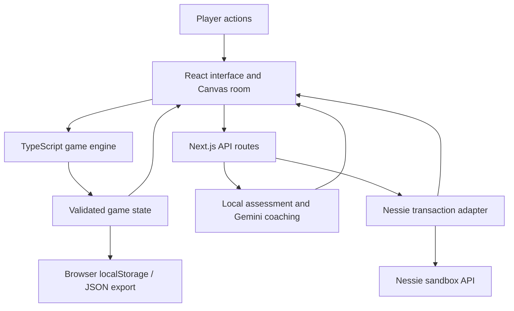

# CashBound

**One room. Your whole life.**

CashBound is an interactive financial life simulation that turns everyday spending into visible changes in a virtual apartment. Players manage a monthly budget, make daily choices, and watch those decisions affect their character's food, energy, health, stress, and home. Google Gemini adds contextual coaching, while the Nessie banking sandbox brings transaction data into the simulation.

The goal is to make financial tradeoffs easier to understand: a balance is a number, but an empty refrigerator, an unpaid bill, or a room improved through consistent saving makes the consequence tangible.

## Project summary

| Topic | Description |
| --- | --- |
| Product | A browser-based financial education game with an interactive isometric apartment |
| Intended audience | Students, first-time budgeters, and people exploring everyday money management |
| Core experience | Plan a budget, live through a 30-day month, review decisions, and improve the next attempt |
| AI integration | Gemini-powered budget feedback and daily coaching grounded in calculated game state |
| Transaction integration | Read-only imports from a server-configured Nessie sandbox account |
| Persistence | Browser-local autosave with JSON export and import |
| Current scope | A single-player prototype with simulated financial consequences |

## Inspiration

Budgeting tools often explain where money went without making the tradeoffs feel immediate. CashBound explores a different approach: make the budget a place the player lives in.

Groceries replenish supplies. Utilities keep the lights on. Saving creates progress. Optional purchases compete with upcoming essentials. A small apartment provides a familiar setting where those relationships can be experienced through play, reflection, and another attempt.

## What it does

### A playable budget

Players create a character, set monthly income, and allocate money across six categories: food, housing, utilities, transport, leisure, and savings. The default profile begins with $3,000 in monthly income and an editable allocation plan.

Furniture connects each category to a recognizable action:

| Room object | Financial interaction |
| --- | --- |
| Refrigerator | Groceries and food spending |
| Kitchen | Utilities |
| Bed | Housing and rent |
| Sofa | Leisure spending |
| Coffee table and savings ledger | Savings transfers |
| Gold keys near the front of the room | Transport spending |
| Work desk | Home-care actions |

Players can click furniture to walk their character to it and open its interaction, or use the surrounding controls. Purchase amounts are editable. Resting and tidying are each available once per day and affect the character or room without erasing financial obligations.

### A daily and monthly gameplay loop

1. **Move in:** customize a character and create a budget. Optionally request a Gemini budget check before starting.
2. **Make choices:** buy necessities, spend on leisure, save money, or care for the character and home.
3. **Import transactions:** when Nessie is configured, load the transactions matching the current game day.
4. **End the day:** calculate spending risk and request a short coaching review. Individual purchases do not trigger daily Gemini reviews.
5. **Respond to feedback:** adjust the next day's choices based on upcoming bills, supplies, and remaining cash.
6. **Close the month:** review spending, savings, category performance, and next-month priorities before continuing settlement.

A month contains 30 days. Food is consumed daily, while rent and utilities settle monthly. Demo runs receive simulated monthly income; Nessie-connected runs receive income through imported transactions.

### Consequences, coaching, and recovery

Spending affects more than the cash balance. The simulation tracks health, entertainment, energy, food stock, stress, clutter, and power. Its forecast considers remaining days and future obligations, so a run can become unsustainable even while cash remains positive.

Fictional endings include food shortage, power loss, eviction, exhaustion, and bankruptcy. An ending animation leads to recovery guidance. Players can restart or rewind to a saved purchase checkpoint and try a different decision. Rewinding preserves a coaching baseline so later feedback can recognize improvements while still accounting for unresolved costs.

These outcomes are educational game mechanics, not predictions about a player's actual finances or health.

### Missions and room progression

Monthly missions reward eligible imported transactions:

| Mission | Target | Reward |
| --- | --- | --- |
| Future-you fund | Transfer $150 to savings | 60 coins |
| Move your body | Spend $25 at a gym or fitness studio | 40 coins |
| Look after yourself | Spend $30 at a pharmacy or health provider | 40 coins |

Manual room purchases do not complete these missions. Duplicate transactions cannot repeatedly earn the same reward. The engine also supports development fixtures as a mission source.

Coins purchase a plant, lamp, rug, bookshelf, or apartment upgrade. Risky discretionary spending can incur a game-coin penalty during the closing review. Coins are separate from cash: rewards and penalties never move bank money.

### An interactive apartment

The room is rendered directly with the HTML Canvas 2D API. It includes peach walls, tiled flooring, a kitchen, retro desk, bed, plants, and a sofa with a coffee table in front.

- Drag to rotate the camera through 360 degrees.
- Use the left and right arrow keys to rotate, or Home to reset the angle.
- Use the camera buttons to zoom from 80% to 200%; the initial view is 110%.
- Foreground walls show only their upper section at 10% opacity, keeping furniture visible and clickable.
- The character walks between destinations, reacts to activity and warnings, and participates in ending animations.
- Select **Arrange furniture** to reposition the refrigerator, kitchen, bed, sofa, savings table, key stand, or desk. Select an item and click an empty floor tile, or use the one-tile move buttons. Placement checks preserve room boundaries, space for decorations, and access to furniture. Layouts autosave and travel with exported games; **Reset layout** restores the original arrangement. Decorative plants, the rug, and shop additions currently stay fixed.
- Responsive layouts and reduced-motion handling support different screens and motion preferences.

History, a journal, budget details, forecasts, monthly summaries, and character customization provide context without replacing the room as the central play space.

## Technology stack

Versions below reflect the ranges declared in `package.json`; `package-lock.json` records the resolved dependency versions.

| Technology | Role |
| --- | --- |
| Next.js 16.2 / App Router | Application framework and server-side API routes |
| React 19.2 | Interactive interface, dialogs, state-driven panels, and canvas lifecycle |
| TypeScript 5.8 | Shared domain types and implementation checks |
| HTML Canvas 2D | Custom isometric projection, furniture rendering, animation, and camera controls |
| Tailwind CSS 4 and custom CSS | Styling, responsive layout, and interface presentation |
| Lucide React | Interface icons |
| Google Gemini | Budget feedback and contextual coaching |
| Google Gen AI SDK (`@google/genai`) | Server-side model requests and structured JSON responses |
| Nessie banking sandbox API | Account and transaction retrieval |
| Zod | Runtime validation of game state, API inputs, provider data, and model output |
| React Hook Form and Zod resolver | Form state and validation |
| Browser localStorage | Local game persistence |
| Node.js test runner | Automated game-logic and adapter tests |
| Chrome DevTools Protocol | Scripted browser checks and screenshots |

The room does not require a third-party game engine or WebGL. The current renderer builds its geometry in code; extracted sprite assets remain available in `public/sprites/` but are not loaded by the room.

## How it is built

### Architecture



The client owns the active game state and presentation. Domain modules implement transactions, daily simulation, forecasting, progression, recovery, and monthly settlement. Server routes hold provider integrations and keep API credentials outside client code.

### Deterministic rules with AI-written coaching

For daily reviews, the application calculates its own assessment before calling Gemini. The model receives selected current-day transactions, financial and character state, the forecast, recent reviews, and previous advice. It writes concise commentary, reasoning, and recovery steps rather than recalculating the financial outcome.

This separation keeps daily risk decisions reproducible while allowing the coaching to respond to context. Zod validates structured output, and review-processing logic checks the returned prose. Invalid responses, unavailable credentials, quota errors, timeouts, and repeated wording can fall back to local commentary. The interface can indicate when local analysis is active.

The initial budget audit is a separate request. Local affordability and category-minimum checks constrain its result. A separate postmortem endpoint supports game assessments and recovery advice.

Gemini requests have a 40-second provider timeout and no automatic retries. Daily client requests allow 45 seconds, and the daily route declares a 50-second execution limit. Hosting limits may impose a shorter deadline. The model is configurable through `GEMINI_MODEL`.

### Transaction normalization and replay protection

The Nessie adapter retrieves accounts and normalizes purchases, transfers, deposits, and withdrawals into a shared transaction format. It categorizes descriptions, interprets transfer direction where available, and excludes unsupported transaction statuses from applied cashflow.

Game Day N selects Day N of the most recent transaction month returned by the adapter. Skipped days are not automatically backfilled. Imports apply the selected day's amounts to the existing game balance instead of replacing it with an account snapshot that may include other dates.

Transaction IDs prevent repeated spending and rewards. Compatibility logic can adopt bank IDs for matching transactions from older file-based runs without replaying their effects. Empty days remain retryable. Savings, gym, and health mission recognition uses transaction kind and description rules.

The application reads Nessie data; manual game actions do not write transactions to the bank. Nessie here is a configured sandbox integration, not a production consumer-bank login flow.

### Rendering and movement

`IsometricEngine.ts` projects a 12-by-12 tile grid into screen coordinates and reverses the projection for pointer interaction. Grid rotation drives the camera. Breadth-first pathfinding routes the avatar around furniture footprints.

`RoomCanvas.tsx` uses `requestAnimationFrame` for drawing and movement. Furniture and avatar rendering use camera depth to determine draw order, including sofa upholstery. Camera interpolation smooths rotation and zoom. Object positions are shared with collision and interaction metadata so furniture remains reachable after layout changes.

### Persistence and validation

Game progress autosaves under the `room-economy-v1` localStorage key. Players can export and import JSON saves; imports are validated and limited to 2 MB. Schema defaults support compatible older saves.

There is no application database or cloud-save service in the current implementation. Saves belong to the browser where the game is played, unless explicitly exported.

## API reference

| Method | Endpoint | Purpose |
| --- | --- | --- |
| `POST` | `/api/gemini/audit` | Check an initial income and allocation plan |
| `POST` | `/api/gemini/day` | Return a grounded daily review for a validated game state |
| `POST` | `/api/gemini/postmortem` | Return an assessment and recovery suggestions |
| `GET` | `/api/nessie/sync?day=N` | Read and normalize sandbox transactions for game day 1–30 |
| `POST` | `/api/nessie/mock` | Create a game-only manual transaction; does not write to Nessie |

Request and response definitions live in `src/schemas/api.ts` and the domain schemas in `src/engine/Types.ts`.

## Run locally

Use Node.js 22.18 or newer and npm for a development environment that supports the project's TypeScript test scripts.

```bash
npm install
npm run dev
```

Open [localhost:3000](http://localhost:3000).

The game can run without provider credentials: manual gameplay remains available and Gemini reviews use local fallback analysis. Nessie imports require sandbox configuration.

### Environment configuration

Copy `.env.example` to `.env.local` and fill in the services you want to use. On PowerShell:

```powershell
Copy-Item .env.example .env.local
```

| Variable | Purpose |
| --- | --- |
| `GEMINI_API_KEY` | Server-side Gemini API credential |
| `GEMINI_MODEL` | Model identifier; the current code and example default to `gemini-3.6-flash` |
| `NESSIE_API_KEY` | Server-side Nessie sandbox credential |
| `NESSIE_CUSTOMER_ID` | Scope account lookup to a sandbox customer |
| `NESSIE_ACCOUNT_ID` | Explicitly select the transaction account; recommended for reproducible demos |
| `NESSIE_BASE_URL` | Defaults to `https://api.nessieisreal.com` |
| `NESSIE_AMOUNT_UNIT` | `dollars` normally; `cents` for the dedicated seed-ledger setup |

Use a Gemini model available to your API project; the repository default is configuration, not a guarantee of provider availability. Restart the development server after changing environment settings.

Keep credentials in `.env.local` or your hosting environment. Do not prefix provider secrets with `NEXT_PUBLIC_`. Environment files are ignored by Git except for the placeholder `.env.example`.

### Optional sandbox seed data

`public/mock-transactions-30-days.json` is a fictional development fixture. The transaction-update flow reads Nessie and does not fetch this file directly.

For an intentional sandbox setup, `node scripts/seed-nessie.mjs` can create or resume seeded account data. Unlike the application's read-only import flow, this development script writes sandbox records. Its dedicated ledger setup stores integer cents and uses `NESSIE_AMOUNT_UNIT=cents`; the adapter converts to dollars once. Preserve the ignored `artifacts/nessie-seed-state.json` checkpoint to resume the setup without duplicating records.

### Production build

```bash
npm run build
npm start
```

Deploy with a Next.js-compatible server runtime and configure provider environment variables on the host. Static-only hosting cannot serve the provider API routes. No specific hosting platform is required by the repository.

## Repository structure

```text
src/
  app/                    Next.js pages, styles, and API routes
  components/
    canvas/               Isometric renderer, camera, and avatar
    features/             Game orchestration and gameplay panels
    hud/                  Status, transaction, and advisor widgets
    modals/               Setup, purchases, summaries, and recovery dialogs
    ui/                   Shared interface components
  engine/                 Rules, forecasts, daily life, missions, and recovery
  lib/                    Gemini, Nessie, and local-save adapters
  schemas/                API validation schemas
public/                   Branding, references, sprites, and development fixture
scripts/                  Browser checks, sandbox seeding, and asset utilities
tests/                    Automated domain and integration-adapter tests
design-system/            Design documentation
```

## Validation

| Command | What it checks |
| --- | --- |
| `npm run typecheck` | TypeScript consistency |
| `npm test` | Game rules, reviews, recovery, progression, forecasts, transaction handling, and geometry |
| `npm run build` | Production compilation |
| `npm run test:browser` | Scripted gameplay with mocked provider responses |
| `npm run test:room` | Dedicated camera and room browser checks |

The last recorded code validation before this documentation update passed TypeScript checking and all 74 automated tests. That result is not a live-provider or production-deployment certification.

Browser scripts require a running development server and currently use an installed Windows Chrome executable. They write screenshots and reports to the ignored `artifacts/` directory. Mocked browser checks and live-provider verification are separate activities.

**Camera test maintenance:** the existing room browser script includes assertions for the former opaque foreground walls and blocked exterior clicks. Those assertions need updating for the current 10%-opacity upper-wall cutaway before the script can serve as a current visual acceptance check.

## Engineering challenges addressed

- **Keeping coaching grounded:** calculate daily consequences locally, then constrain and validate model-written explanations.
- **Avoiding duplicate financial effects:** normalize provider records and apply each transaction and monthly reward only once.
- **Making rotation coherent:** depth-sort furniture, coordinate projected clicks with the camera, and reveal the interior through foreground-wall cutaways.
- **Making failure useful:** combine visible consequences, recovery forecasts, and a rewind checkpoint that retains prior coaching context.
- **Keeping month boundaries consistent:** present the closing summary before settlement and guard against repeated continuation.
- **Handling service failures:** provide local analysis and explicit connection errors so the core simulation can continue without Gemini.

## What the prototype demonstrates

CashBound combines a playable apartment, a financial rules engine, structured AI coaching, and transaction-driven progression in one application. Its central achievement is connecting abstract spending decisions to visible consequences while keeping the daily financial assessment independently testable.

The implementation illustrates the value of separating simulation, presentation, and generated language. It also shows why importing financial records requires careful treatment of dates, units, transaction direction, and repeated requests—even in a sandbox.

## Current limitations and next steps

The current project is a single-player educational prototype. Transaction categories and mission recognition rely on description-based rules. Account selection is server-configured, game state is browser-local, and the simulation intentionally simplifies personal finance. The prototype does not implement production authentication, per-user banking authorization, or cloud synchronization.

Potential next steps, not currently implemented:

- User accounts, cloud saves, and explicitly authorized per-user financial connections.
- Better transaction categorization with player correction and review.
- More scenarios, recurring obligations, and configurable difficulty.
- Broader keyboard and assistive-technology support for the canvas interactions.
- Updated cross-platform visual regression checks for camera angles and zoom levels.
- User research to evaluate whether the game improves understanding and sustained budgeting habits.

## Devpost-ready short description

> CashBound turns your budget into a place you live. Manage a character's finances inside an interactive isometric apartment, where spending affects food, energy, bills, and everyday life. Gemini provides coaching grounded in the game's financial forecast, and Nessie sandbox transactions connect spending records to missions and room upgrades. Plan, play, reflect, and rewind to explore how different choices change your month.

**Suggested “Built with” tags:** Next.js, React, TypeScript, Tailwind CSS, HTML Canvas, Google Gemini, Google Gen AI SDK, Nessie API, Zod, Node.js.

### Suggested demo sequence

1. Customize the character and show the six-category budget, including the optional Gemini audit.
2. Rotate and zoom the apartment, then click a room object and enter a purchase.
3. Show a configured Nessie transaction import and explain how duplicate imports are handled.
4. End the day to display coaching and the forecast behind it.
5. Demonstrate a mission reward or furniture upgrade with prepared sandbox data.
6. Show a risky scenario, recovery guidance, and rewind; finish with the monthly summary if time permits.

Before publishing the submission, add the team's names, a public demo URL, and a demo video URL in Devpost. Those details are not specified in this repository.
